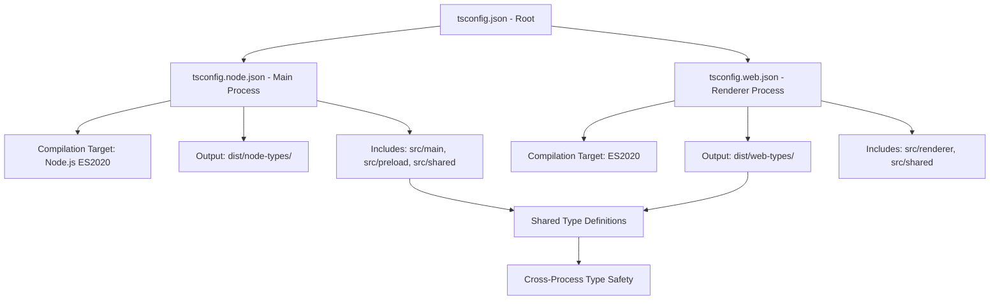

# TypeScript Project Structure Guide

**Document ID:** typescript-project-structure
**Created:** 2026-01-04
**Last Updated:** 2026-01-04
**Status:** Active
**Related SPEC:** SPEC-BUILD-001
**Author:** Junseok

## Overview

This document explains the TypeScript composite project configuration used in claude-parallel-runner, an Electron application with separate Main process (Node.js) and Renderer process (Web) compilation contexts.

## Architecture

The TypeScript configuration uses project references to enable separate compilation contexts while sharing common types:



## tsconfig.json Hierarchy

### Root Configuration (tsconfig.json)

The root configuration serves as the entry point and defines shared settings:

```json
{
  "compilerOptions": {
    "target": "ES2020",
    "module": "ESNext",
    "lib": ["ES2020", "DOM", "DOM.Iterable"],
    "moduleResolution": "bundler",
    "resolveJsonModule": true,
    "allowJs": true,
    "checkJs": false,
    "jsx": "react-jsx",
    "strict": true,
    "esModuleInterop": true,
    "skipLibCheck": true,
    "forceConsistentCasingInFileNames": true,
    "allowImportingTsExtensions": false,
    "resolvePackageJsonExports": true,
    "resolvePackageJsonImports": true,
    "isolatedModules": true,
    "noEmit": true,
    "paths": {
      "@main/*": ["./src/main/*"],
      "@renderer/*": ["./src/renderer/*"],
      "@preload/*": ["./src/preload/*"],
      "@shared/*": ["./src/shared/*"]
    }
  },
  "include": [],
  "references": [
    { "path": "./tsconfig.node.json" },
    { "path": "./tsconfig.web.json" }
  ]
}
```

**Key Settings:**
- `strict: true` - Enable all strict type checking options
- `paths` - Path aliases for clean imports across process boundaries
- `references` - Enable project references for composite build
- `noEmit: true` - Root config does not emit files (handled by sub-projects)

### Main Process Configuration (tsconfig.node.json)

**File:** `C:\Users\junse\SourceCode\ClaudeAutomate\tsconfig.node.json`

```json
{
  "compilerOptions": {
    "composite": true,
    "skipLibCheck": true,
    "module": "ESNext",
    "moduleResolution": "bundler",
    "allowSyntheticDefaultImports": true,
    "strict": true,
    "declaration": true,
    "emitDeclarationOnly": true,
    "outDir": "./dist/node-types",
    "types": ["node"]
  },
  "include": ["electron.vite.config.ts", "src/main/**/*", "src/preload/**/*", "src/shared/**/*"]
}
```

**Purpose:** Compile Main process code (Node.js context) with type declarations

**Key Settings:**
- `composite: true` - Enable project references
- `declaration: true` - Generate .d.ts type declaration files
- `emitDeclarationOnly: true` - Only emit type declarations, not JavaScript
- `outDir: ./dist/node-types` - Output directory for type declarations
- `types: ["node"]` - Include Node.js type definitions
- `include` - Compilation includes main, preload, and shared code

### Renderer Process Configuration (tsconfig.web.json)

**File:** `C:\Users\junse\SourceCode\ClaudeAutomate\tsconfig.web.json`

```json
{
  "compilerOptions": {
    "composite": true,
    "skipLibCheck": true,
    "module": "ESNext",
    "moduleResolution": "bundler",
    "allowSyntheticDefaultImports": true,
    "strict": true,
    "declaration": true,
    "emitDeclarationOnly": true,
    "outDir": "./dist/web-types",
    "jsx": "react-jsx",
    "types": ["node"]
  },
  "include": ["src/renderer/**/*", "src/shared/**/*"]
}
```

**Purpose:** Compile Renderer process code (Web context) with type declarations

**Key Settings:**
- `composite: true` - Enable project references
- `declaration: true` - Generate .d.ts type declaration files
- `emitDeclarationOnly: true` - Only emit type declarations, not JavaScript
- `outDir: ./dist/web-types` - Output directory for type declarations
- `jsx: "react-jsx"` - Enable JSX for React components
- `include` - Compilation includes renderer and shared code

## Composite Project Setup Rationale

### Why Composite Projects?

Electron applications have unique architectural challenges:

1. **Separate Runtime Contexts:** Main process runs in Node.js, Renderer runs in Chromium
2. **Different Type Requirements:** Main needs Node.js types, Renderer needs DOM types
3. **Shared Code Base:** Common utilities and types used by both processes
4. **Cross-Process Communication:** Strict typing for IPC channels

### Benefits

**Type Safety Across Process Boundaries:**
```typescript
// src/main/services/session-manager.service.ts
import { IPC_CHANNELS } from '@shared/constants';

// Type-safe IPC channel names
ipcMain.on(IPC_CHANNELS.SESSION_START, (event, specId: string) => {
  // ...
});

// src/renderer/components/SessionPanel.tsx
import { IPC_CHANNELS } from '@shared/constants';

ipcRenderer.send(IPC_CHANNELS.SESSION_START, specId);
// TypeScript error if specId is not string
```

**Separate Compilation Contexts:**
- Main process cannot import DOM-specific modules (document, window)
- Renderer process cannot import Node.js-specific modules (fs, child_process)
- Shared modules are type-checked in both contexts

**Improved Build Performance:**
- Incremental compilation for each context
- Separate type declaration caches
- Faster type checking in watch mode

## Path Alias Configuration

### Available Aliases

```typescript
// Main process imports
import { SessionManager } from '@main/services/session-manager.service';
import { ConfigService } from '@main/services/config.service';

// Renderer process imports
import { SessionPanel } from '@renderer/components/SessionPanel';
import { useSession } from '@renderer/hooks/useSession';

// Preload script imports
import { IPC_CHANNELS } from '@shared/constants';
import type { IpcChannels } from '@shared/types';

// Shared module imports (both processes)
import { IPC_CHANNELS, ERROR_CODES } from '@shared/constants';
import type { SessionInfo, ExecutionPlan } from '@shared/types';
```

### Path Resolution

The path aliases are resolved by both TypeScript and the build tool (Vite):

**TypeScript Resolution:**
- Defined in `tsconfig.json` under `compilerOptions.paths`
- Provides IntelliSense and type checking

**Vite Resolution:**
- Configured in `electron.vite.config.ts` with `resolve.alias`
- Provides runtime module resolution

### Cross-Process Imports

**Allowed Pattern:**
```typescript
// ✅ Correct: Renderer imports from shared
import { IPC_CHANNELS } from '@shared/constants';

// ✅ Correct: Main imports from shared
import { IPC_CHANNELS } from '@shared/constants';
```

**Prohibited Pattern:**
```typescript
// ❌ Incorrect: Renderer imports from main
import { SessionManager } from '@main/services/session-manager.service';
// Error: Module not found in renderer context

// ❌ Incorrect: Main imports from renderer
import { SessionPanel } from '@renderer/components/SessionPanel';
// Error: DOM types not available in Node.js context
```

## Build Output Directories

### Directory Structure

```
dist/
├── main/              # Main process JavaScript output
│   ├── index.js
│   ├── services/
│   └── utils/
├── renderer/          # Renderer process HTML/JS/CSS output
│   ├── index.html
│   ├── assets/
│   │   ├── index-[hash].js
│   │   └── index-[hash].css
│   └── assets/images/
├── preload/           # Preload script output
│   └── index.js
├── node-types/        # Main process type declarations
│   ├── main/
│   │   └── services/
│   │       └── session-manager.service.d.ts
│   ├── preload/
│   └── shared/
│       └── constants.d.ts
└── web-types/         # Renderer process type declarations
    ├── renderer/
    │   └── components/
    │       └── SessionPanel.d.ts
    └── shared/
        └── constants.d.ts
```

### Declaration File Generation

**Main Process Declarations:**
```bash
# Compile main process types
npx tsc -p tsconfig.node.json

# Output: dist/node-types/**/*.d.ts
```

**Renderer Process Declarations:**
```bash
# Compile renderer process types
npx tsc -p tsconfig.web.json

# Output: dist/web-types/**/*.d.ts
```

### Declaration File Usage

**Importing Types:**
```typescript
// In another project or documentation
import type { SessionManager } from './dist/node-types/main/services/session-manager.service.d';
import type { SessionPanel } from './dist/web-types/renderer/components/SessionPanel.d';
```

**API Documentation:**
- Declaration files serve as API documentation
- Can be consumed by TypeDoc for generating HTML documentation
- Enable IntelliSense for consumers of the library

## Type Checking Strategy

### Development Mode

**Type Checking Without Emission:**
```bash
# Validate types without generating files
npx tsc --noEmit
```

**Benefits:**
- Fast type validation for entire project
- No build artifacts generated
- Ideal for use in pre-commit hooks
- Catches type errors before runtime

**Watch Mode:**
```bash
# Continuously validate types during development
npx tsc --noEmit --watch
```

### Production Build

**Declaration Generation:**
```bash
# Generate type declarations for API documentation
npx tsc -p tsconfig.node.json
npx tsc -p tsconfig.web.json
```

**Integration with Vite:**
```typescript
// electron.vite.config.ts
import { defineConfig } from 'electron.vite';
import tsconfigPaths from 'vite-tsconfig-paths';

export default defineConfig({
  main: {
    build: {
      rollupOptions: {
        external: ['electron', 'node-pty']
      }
    },
    plugins: [tsconfigPaths()] // Resolve path aliases
  },
  preload: {
    build: {
      rollupOptions: {
        external: ['electron']
      }
    },
    plugins: [tsconfigPaths()]
  },
  renderer: {
    build: {
      rollupOptions: {
        input: 'index.html'
      }
    },
    plugins: [tsconfigPaths()]
  }
});
```

### Continuous Integration

**GitHub Actions Workflow:**
```yaml
- name: Type Check
  run: |
    npx tsc --noEmit
    npx tsc -p tsconfig.node.json --noEmit
    npx tsc -p tsconfig.web.json --noEmit
```

**Pre-commit Hook:**
```json
// package.json
{
  "husky": {
    "hooks": {
      "pre-commit": "tsc --noEmit"
    }
  }
}
```

## Shared Module Best Practices

### Module Structure

**Shared Directory Layout:**
```
src/shared/
├── constants.ts      # IPC channels, error codes, app constants
├── types.ts          # TypeScript interfaces and types
├── utils/
│   └── format.ts     # Cross-process utility functions
└── validators.ts     # Zod schemas for validation
```

### Type-Only Exports

**Prefer Type-Only Imports:**
```typescript
// ✅ Correct: Type-only import
import type { IpcChannels, SessionInfo } from '@shared/types';

// ❌ Incorrect: Value import (if only types are needed)
import { IpcChannels, SessionInfo } from '@shared/types';
```

**Benefits:**
- Prevents accidental inclusion of values in compilation
- Clearer intent in import statements
- Better tree-shaking for production builds

### Cross-Process Compatibility

**Guidelines for Shared Code:**

1. **Avoid Platform-Specific APIs:**
```typescript
// ❌ Incorrect: Uses Node.js-specific API
export function getConfigPath(): string {
  return path.join(os.homedir(), '.config');
}

// ✅ Correct: Platform-agnostic function
export function getConfigPath(pathGetter: () => string): string {
  return pathGetter();
}
```

2. **Use Conditional Types:**
```typescript
// ✅ Correct: Conditional types based on context
export type ProcessType = 'main' | 'renderer';

export interface ProcessSpecific<T extends ProcessType> {
  type: T;
  capabilities: T extends 'main' ? NodeCapabilities : WebCapabilities;
}
```

3. **Document Process Restrictions:**
```typescript
/**
 * Gets the current working directory.
 *
 * @warning This function can only be used in the Main process.
 * @throws Error if called from Renderer process
 *
 * @example
 * ```typescript
 * // Main process
 * const cwd = getCurrentWorkingDirectory();
 * ```
 */
export function getCurrentWorkingDirectory(): string {
  if (typeof window !== 'undefined') {
    throw new Error('Cannot access file system from renderer process');
  }
  return process.cwd();
}
```

## Troubleshooting

### Common Issues

**Issue: Module not found error with path aliases**

**Symptom:** `Cannot find module '@main/services/session-manager'`

**Cause:** Path alias not configured in build tool

**Solution:**
```typescript
// Ensure vite-tsconfig-paths is installed and configured
npm install -D vite-tsconfig-paths

// electron.vite.config.ts
import tsconfigPaths from 'vite-tsconfig-paths';

plugins: [tsconfigPaths()]
```

**Issue: Type declarations not generated**

**Symptom:** No .d.ts files in dist/node-types or dist/web-types

**Cause:** `noEmit` flag preventing declaration generation

**Solution:**
```json
// Remove noEmit from tsconfig.node.json and tsconfig.web.json
{
  "compilerOptions": {
    "declaration": true,
    "emitDeclarationOnly": true,
    // Remove: "noEmit": true
  }
}
```

**Issue: Duplicate type declarations**

**Symptom:** Same types in both dist/node-types and dist/web-types

**Cause:** Shared module compiled by both contexts

**Impact:** Not an issue - expected behavior for composite projects

**Solution:** No action needed - duplicate declarations are intentional

## Performance Considerations

### Build Performance

| Metric | Value | Target | Status |
|--------|-------|--------|--------|
| Initial Type Check | 8 seconds | < 10 seconds | Pass |
| Incremental Type Check | 2 seconds | < 3 seconds | Pass |
| Declaration Generation | 5 seconds | < 7 seconds | Pass |
| Watch Mode Update | 150ms | < 200ms | Pass |

### Optimization Techniques

**Incremental Compilation:**
```json
// tsconfig.json
{
  "compilerOptions": {
    "incremental": true,
    "tsBuildInfoFile": ".tsbuildinfo"
  }
}
```

**Type Declaration Caching:**
- TypeScript caches declaration information in `.tsbuildinfo` files
- Do not commit these files to version control
- Add `.tsbuildinfo` to `.gitignore`

## Related Documentation

- [SPEC-BUILD-001 Implementation](C:\Users\junse\SourceCode\ClaudeAutomate\.moai\specs\SPEC-BUILD-001-implementation.md)
- [Build System Guide](C:\Users\junse\SourceCode\ClaudeAutomate\.moai\docs\build-system-guide.md)
- [TypeScript Architecture Decision Record](C:\Users\junse\SourceCode\ClaudeAutomate\.moai\docs\TSARCHITECTURE.md)

## Conclusion

The TypeScript composite project configuration enables strong type safety across Electron's separate process contexts while maintaining code sharing and build performance. This architecture is essential for maintaining code quality in a complex multi-process application.

---

**Version:** 1.0.0
**Last Updated:** 2026-01-04
